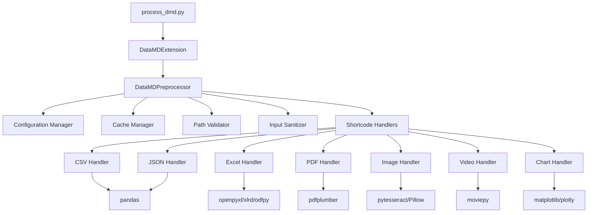

# Data Markdown (DataMD) Technical Specification

## 1. Overview

This document provides detailed technical specifications for implementing the enhancements outlined in the Product Requirements Document (PRD) for Data Markdown (DataMD).

## 2. Architecture

### 2.1 Current Architecture
DataMD follows a plugin-based architecture with shortcode handlers:
- `.dmd` files are parsed and processed by `process_dmd.py`
- Shortcodes trigger respective data handlers (e.g., CSV, JSON, OCR)
- Output is rendered as HTML or Markdown depending on the rendering path

### 2.2 Enhanced Architecture
The enhanced architecture will maintain the plugin-based approach while adding:
- Centralized configuration management
- Caching layer for performance optimization
- Extended error handling framework
- Advanced data processing pipeline

### 2.3 Component Diagram


## 3. Detailed Feature Specifications

### 3.1 Video Thumbnail Generation (F-001)

#### 3.1.1 Requirements
- Implement `video_thumb` shortcode: `{{ video_thumb "clip.mp4" 5 }}`
- Generate thumbnail at specified time (in seconds)
- Support custom dimensions: `{{ video_thumb "clip.mp4" 5 800 600 }}`
- Handle video processing errors gracefully
- Cache generated thumbnails to avoid regeneration

#### 3.1.2 Implementation
- Use moviepy library for video processing
- Add new handler in `datamd_ext.py`
- Implement caching to avoid regenerating thumbnails
- Add error handling for unsupported formats

#### 3.1.3 Technical Details
```python
# In datamd_ext.py
elif cmd == "video_thumb":
    try:
        # Validate inputs
        time_sec = float(args[0]) if args else 0
        width = int(args[1]) if len(args) > 1 else 320
        height = int(args[2]) if len(args) > 2 else 240

        # Validate file path
        validated_path = validate_file_path(file_path)

        # Check cache first
        cache_manager = CacheManager()
        cache_key = f"video_thumb:{file_path}:{time_sec}:{width}:{height}"
        cached_result = cache_manager.get(cache_key)
        if cached_result:
            new_lines.append(cached_result)
            return

        # Generate thumbnail using moviepy
        from moviepy.editor import VideoFileClip
        clip = VideoFileClip(str(validated_path))
        frame = clip.get_frame(t=time_sec)

        # Save as image
        from PIL import Image
        image = Image.fromarray(frame)
        # Resize if needed
        image = image.resize((width, height))
        # Save thumbnail
        thumb_filename = f"{validated_path.stem}_thumb_{time_sec}.jpg"
        thumb_path = validated_path.parent / thumb_filename
        image.save(thumb_path)

        # Create HTML img tag
        result = f''

        # Cache result
        cache_manager.set(cache_key, result)

        new_lines.append(result)

    except Exception as e:
        new_lines.append(f"❌ Error generating thumbnail: {str(e)}")
```

#### 3.1.4 Dependencies
- moviepy>=1.0.0 (already in requirements)
- Pillow>=9.0.0 (already in requirements)

#### 3.1.5 Testing Strategy
- Unit tests for valid and invalid inputs
- Integration tests with sample video files
- Performance tests for thumbnail generation
- Cache effectiveness tests

### 3.2 Enhanced PDF Table Extraction (F-002)

#### 3.2.1 Requirements
- Improve existing `pdf_table` shortcode
- Add options for table detection thresholds
- Support multiple table extraction strategies
- Better handling of merged cells
- Configurable extraction parameters

#### 3.2.2 Implementation
- Extend pdfplumber configuration options
- Add parameters for table detection sensitivity
- Implement fallback strategies for complex tables

#### 3.2.3 Technical Details
```python
# In datamd_ext.py
elif cmd == "pdf_table":
    try:
        page = int(args[0]) - 1 if args else 0
        # Additional parameters for enhanced extraction
        horizontal_strategy = args[1] if len(args) > 1 else "lines"
        vertical_strategy = args[2] if len(args) > 2 else "lines"
        text_tolerance = int(args[3]) if len(args) > 3 else 3

        # Validate file path
        validated_path = validate_file_path(file_path)

        with pdfplumber.open(validated_path) as pdf:
            # Configure table extraction with additional options
            tables = pdf.pages[page].extract_tables({
                "horizontal_strategy": horizontal_strategy,
                "vertical_strategy": vertical_strategy,
                "text_tolerance": text_tolerance
            })
            # Process tables as before
            if tables:
                for i, table in enumerate(tables):
                    if table and len(table) > 1:
                        df = pd.DataFrame(table[1:], columns=table[0])
                        new_lines.append(f"### Table {i+1}")
                        new_lines.append(df.to_markdown(index=False))
                        new_lines.append("")
            else:
                new_lines.append("No tables found on this page.")

    except Exception as e:
        new_lines.append(f"❌ Error extracting PDF tables: {str(e)}")
```

#### 3.2.4 Dependencies
- pdfplumber>=0.7.0 (already in requirements)

#### 3.2.5 Testing Strategy
- Unit tests with various PDF table structures
- Integration tests with sample PDF files
- Performance tests with large PDFs
- Validation of different extraction strategies

### 3.3 Configuration System (F-005)

#### 3.3.1 Requirements
- Centralized configuration management
- Support for default settings
- Environment-specific configurations
- User override capabilities
- JSON configuration file support

#### 3.3.2 Implementation
- Create configuration class in new `config.py` file
- Support JSON configuration files
- Environment variable overrides
- Default configuration values

#### 3.3.3 Technical Details
```python
# config.py
import json
import os
from pathlib import Path
from typing import Any, Dict

class DataMDConfig:
    def __init__(self, config_file=None):
        # Default configuration values
        self.defaults = {
            "table_style": "grid",
            "video_width": 640,
            "video_height": 480,
            "pdf_table_strategy": {
                "horizontal": "lines",
                "vertical": "lines",
                "text_tolerance": 3
            },
            "cache_enabled": True,
            "cache_dir": ".datamd_cache",
            "security": {
                "allow_external_paths": False,
                "max_file_size_mb": 100
            }
        }

        self.config = self.defaults.copy()

        # Load from file if provided
        if config_file and Path(config_file).exists():
            try:
                with open(config_file, 'r') as f:
                    file_config = json.load(f)
                    self._deep_update(self.config, file_config)
            except Exception as e:
                print(f"Warning: Failed to load config file {config_file}: {e}")

        # Override with environment variables
        self._load_from_env()

    def _deep_update(self, d, u):
        """Deep update nested dictionaries"""
        for k, v in u.items():
            if isinstance(v, dict):
                d[k] = self._deep_update(d.get(k, {}), v)
            else:
                d[k] = v
        return d

    def _load_from_env(self):
        """Load configuration from environment variables"""
        # Example: DATAMD_TABLE_STYLE=github
        for key in self.defaults:
            env_key = f"DATAMD_{key.upper()}"
            if env_key in os.environ:
                self.config[key] = os.environ[env_key]

    def get(self, key: str, default: Any = None) -> Any:
        """Get configuration value with dot notation for nested keys"""
        keys = key.split('.')
        value = self.config
        try:
            for k in keys:
                value = value[k]
            return value
        except (KeyError, TypeError):
            return default if default is not None else self._get_nested_default(key)

    def _get_nested_default(self, key: str) -> Any:
        """Get nested default value"""
        keys = key.split('.')
        value = self.defaults
        try:
            for k in keys:
                value = value[k]
            return value
        except (KeyError, TypeError):
            return None

    def set(self, key: str, value: Any):
        """Set configuration value"""
        keys = key.split('.')
        config = self.config
        for k in keys[:-1]:
            if k not in config:
                config[k] = {}
            config = config[k]
        config[keys[-1]] = value
```

#### 3.3.4 Dependencies
- No additional dependencies required

#### 3.3.5 Testing Strategy
- Unit tests for configuration loading and access
- Integration tests with configuration files
- Environment variable override tests
- Default value validation tests

### 3.4 Caching Mechanism (F-010)

#### 3.4.1 Requirements
- Cache processed results to avoid reprocessing
- File-based caching with expiration
- Configurable cache directory
- Automatic cache invalidation when source files change
- Cache size management

#### 3.4.2 Implementation
- Create cache manager class
- Use file modification timestamps for invalidation
- Hash-based cache keys
- Configurable cache directory

#### 3.4.3 Technical Details
```python
# cache.py
import hashlib
import json
import os
import pickle
import time
from pathlib import Path
from typing import Any, Optional

class CacheManager:
    def __init__(self, cache_dir=".datamd_cache", max_age_hours=24):
        self.cache_dir = Path(cache_dir)
        self.cache_dir.mkdir(exist_ok=True)
        self.max_age = max_age_hours * 3600  # Convert to seconds

    def _get_cache_key(self, identifier: str) -> str:
        """Create unique key based on identifier"""
        return hashlib.md5(identifier.encode()).hexdigest()

    def get(self, identifier: str) -> Optional[Any]:
        """Retrieve cached data if available and not expired"""
        cache_key = self._get_cache_key(identifier)
        cache_file = self.cache_dir / f"{cache_key}.cache"

        if cache_file.exists():
            # Check if cache is still valid
            file_age = time.time() - cache_file.stat().st_mtime
            if file_age < self.max_age:
                try:
                    with open(cache_file, 'rb') as f:
                        return pickle.load(f)
                except:
                    # Corrupted cache, remove it
                    try:
                        cache_file.unlink()
                    except:
                        pass
                    pass  # Will regenerate

        return None

    def set(self, identifier: str, data: Any):
        """Store data in cache"""
        cache_key = self._get_cache_key(identifier)
        cache_file = self.cache_dir / f"{cache_key}.cache"

        try:
            with open(cache_file, 'wb') as f:
                pickle.dump(data, f)
        except Exception as e:
            print(f"Warning: Failed to cache data: {e}")

    def clear(self):
        """Clear all cached data"""
        for cache_file in self.cache_dir.glob("*.cache"):
            try:
                cache_file.unlink()
            except:
                pass

    def cleanup_expired(self):
        """Remove expired cache entries"""
        current_time = time.time()
        for cache_file in self.cache_dir.glob("*.cache"):
            try:
                if current_time - cache_file.stat().st_mtime > self.max_age:
                    cache_file.unlink()
            except:
                pass
```

#### 3.4.4 Dependencies
- No additional dependencies required

#### 3.4.5 Testing Strategy
- Unit tests for cache operations
- Integration tests with actual file processing
- Cache invalidation tests
- Performance tests measuring cache effectiveness

### 3.5 Data Transformation (F-003)

#### 3.5.1 Requirements
- Support for data filtering, sorting, and aggregation
- SQL-like syntax for transformations
- Integration with existing data handlers
- Support for multiple transformation operations

#### 3.5.2 Implementation
- Add transformation parameters to existing shortcodes
- Implement simple query language for data operations
- Leverage pandas for data manipulation

#### 3.5.3 Technical Details
```python
# Example extension to CSV handler
elif cmd == "csv":
    try:
        # Parse arguments
        sep = ","
        transformations = []

        for arg in args:
            if arg.startswith("sep="):
                sep = arg[4:]
            elif arg.startswith("filter="):
                transformations.append(("filter", arg[7:]))
            elif arg.startswith("sort="):
                transformations.append(("sort", arg[5:]))
            elif arg.startswith("limit="):
                transformations.append(("limit", arg[6:]))
            elif arg.startswith("groupby="):
                transformations.append(("groupby", arg[8:]))

        # Validate file path
        validated_path = validate_file_path(file_path)

        # Load data
        df = pd.read_csv(validated_path, sep=sep)

        # Apply transformations
        for transform_type, transform_expr in transformations:
            if transform_type == "filter":
                # Simple filter syntax: filter=column=value
                if "=" in transform_expr:
                    col, val = transform_expr.split("=", 1)
                    # Try to convert value to appropriate type
                    try:
                        val = int(val)
                    except ValueError:
                        try:
                            val = float(val)
                        except ValueError:
                            pass  # Keep as string
                    df = df[df[col] == val]
            elif transform_type == "sort":
                # Sort by column (prefix with - for descending)
                if transform_expr.startswith("-"):
                    col = transform_expr[1:]
                    df = df.sort_values(by=col, ascending=False)
                else:
                    df = df.sort_values(by=transform_expr)
            elif transform_type == "limit":
                # Limit number of rows
                limit = int(transform_expr)
                df = df.head(limit)
            elif transform_type == "groupby":
                # Group by column and count
                df = df.groupby(transform_expr).size().reset_index(name='count')

        # Convert to markdown
        new_lines.append(df.to_markdown(index=False))

    except Exception as e:
        new_lines.append(f"❌ Error processing CSV: {str(e)}")
```

#### 3.5.4 Dependencies
- pandas>=1.5.0 (already in requirements)

#### 3.5.5 Testing Strategy
- Unit tests for each transformation type
- Integration tests with sample data files
- Edge case tests with empty results
- Performance tests with large datasets

## 4. Error Handling Framework

### 4.1 File Validation
```python
def validate_file_path(file_path: str) -> Path:
    """Validate file path and check existence"""
    # Resolve path to prevent directory traversal
    try:
        resolved_path = Path(file_path).resolve()
    except Exception:
        raise ValueError(f"Invalid file path: {file_path}")

    # Check if file exists
    if not resolved_path.exists():
        raise FileNotFoundError(f"File not found: {file_path}")

    # Check if path is within working directory (basic security)
    working_dir = Path.cwd().resolve()
    if not str(resolved_path).startswith(str(working_dir)):
        # Allow if configuration permits external paths
        from config import DataMDConfig
        config = DataMDConfig()
        if not config.get("security.allow_external_paths", False):
            raise ValueError(f"Access denied to file outside working directory: {file_path}")

    # Check file size
    max_size = config.get("security.max_file_size_mb", 100) * 1024 * 1024
    if resolved_path.stat().st_size > max_size:
        raise ValueError(f"File too large: {file_path} (max {max_size} bytes)")

    return resolved_path
```

### 4.2 Graceful Error Handling
```python
# In DataMDPreprocessor.run()
try:
    validated_path = validate_file_path(file_path)
    # Process file...
except FileNotFoundError as e:
    new_lines.append(f"⚠️ Error: {str(e)}")
except ValueError as e:
    new_lines.append(f"🔒 Security Error: {str(e)}")
except Exception as e:
    new_lines.append(f"❌ Processing Error: {cmd} file {file_path}: {str(e)}")
```

## 5. Testing Strategy

### 5.1 Unit Tests
- Test each shortcode handler with valid and invalid inputs
- Test error conditions and edge cases
- Test configuration loading and overrides
- Test caching functionality

### 5.2 Integration Tests
- Test complete processing pipeline
- Test cross-format data handling
- Test performance with large files
- Test security validation

### 5.3 Test Data
Create test files for each supported format:
- CSV with various delimiters and edge cases
- JSON with nested structures and arrays
- Excel files with multiple sheets and formats
- PDFs with tables and text
- Sample images for OCR testing
- Sample videos for thumbnail generation

### 5.4 Test Framework
```python
# test_video_thumb.py
import pytest
from pathlib import Path
import tempfile
import shutil

def test_video_thumb_basic():
    """Test basic video thumbnail generation"""
    # This would require a sample video file in the test data
    pass

def test_video_thumb_custom_dimensions():
    """Test video thumbnail with custom dimensions"""
    pass

def test_video_thumb_invalid_time():
    """Test video thumbnail with invalid time parameter"""
    pass

def test_video_thumb_invalid_file():
    """Test video thumbnail with non-existent file"""
    pass
```

## 6. Performance Optimization

### 6.1 Memory Management
- Use generators for large file processing
- Implement streaming for large datasets
- Clean up temporary files after processing

### 6.2 Processing Optimization
- Parallel processing for independent operations
- Lazy loading of data when possible
- Efficient data structures for transformations

### 6.3 Caching Strategy
- Cache expensive operations (OCR, video processing)
- Implement cache invalidation based on file modification times
- Monitor cache size and implement cleanup policies

## 7. Security Considerations

### 7.1 Input Validation
- Validate all file paths to prevent directory traversal
- Sanitize input parameters
- Limit file access to working directory
- Check file size limits

### 7.2 Output Sanitization
- Escape HTML output to prevent XSS
- Validate generated file paths
- Limit resource usage to prevent DoS

### 7.3 Configuration Security
- Secure handling of configuration files
- Environment variable security
- Default secure settings

## 8. Backward Compatibility

### 8.1 Maintaining Existing Features
- All existing shortcodes must continue to work
- Default behavior must remain unchanged
- Configuration defaults must match current behavior

### 8.2 Deprecation Strategy
- Clearly document any deprecated features
- Provide migration paths
- Maintain deprecated features for at least 2 major versions

## 9. Deployment Considerations

### 9.1 Packaging
- Update pyproject.toml with new dependencies
- Ensure proper installation of optional components
- Document system requirements

### 9.2 Documentation Updates
- Update SYNTAX.md with new features
- Add examples for all new shortcodes
- Update README with new capabilities
- Create migration guide if needed

## 10. Monitoring and Logging

### 10.1 Logging Framework
- Implement structured logging
- Log processing steps for debugging
- Log errors with context information
- Support different log levels

### 10.2 Performance Monitoring
- Track processing times
- Monitor memory usage
- Collect statistics on cache hits/misses

### 10.3 Error Reporting
- Centralized error collection
- Error categorization and tagging
- Integration with issue tracking systems
